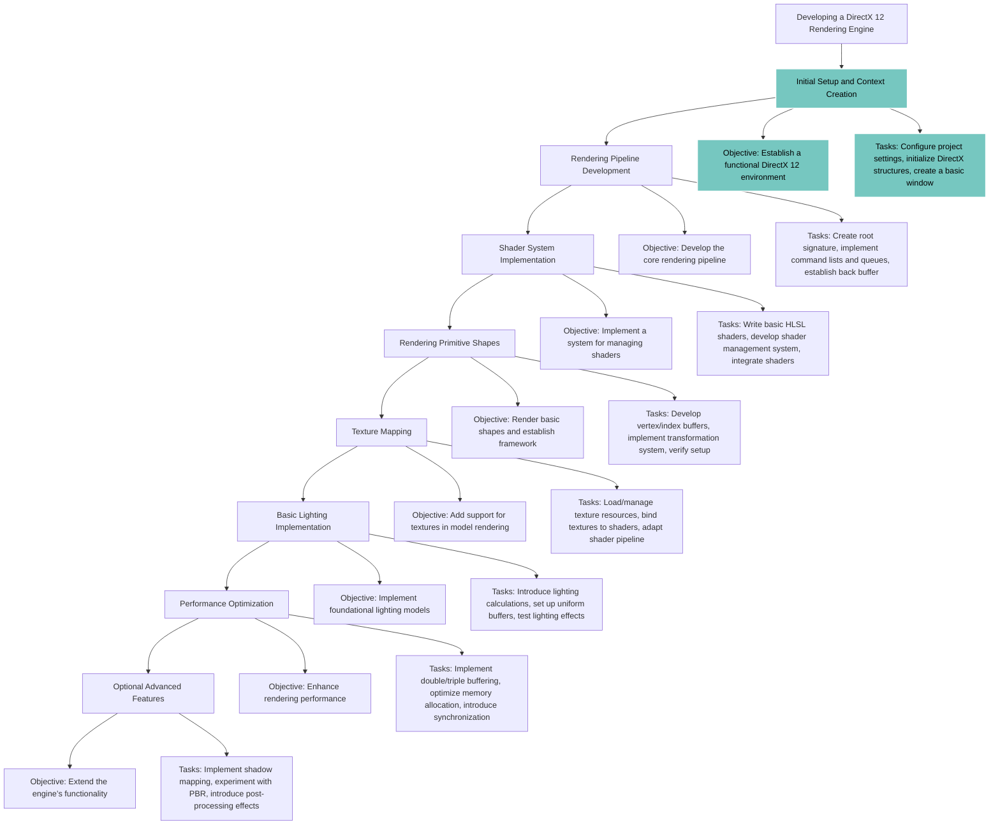

<h1>Developing a DirectX 12 Rendering Engine as an Independent Project</h1>

<!-- Skill and Language Badges -->

  
  
  
  
  ">

<h2>Project Overview</h2>

This project aims to create a rendering engine using DirectX 12 to gain a more comprehensive understanding of graphics programming and low-level systems operations. DirectX 12 offers fine-grained control over hardware resources, providing efficiency benefits but also introducing significant complexity. This endeavor will require in-depth work with rendering pipelines, memory management, and GPU programming.

<h2>Project Objectives</h2>
<ul>
  <li>To develop a basic rendering engine using DirectX 12</li>
  <li>To deepen understanding of graphics APIs and their architectural requirements</li>
  <li>To create an extensible engine architecture for potential future projects</li>
  <li>To explore systems programming fundamentals in greater detail</li>
</ul>

<h2>Prerequisites</h2>

Prior to initiating this project, it is essential to have a solid foundation in the following areas:

<ul>
  <li><strong>C++ Proficiency</strong>: DirectX 12 necessitates an intermediate to advanced understanding of C++ for efficient memory management, pointers, and the use of data structures optimized for performance.</li>
  <li><strong>Graphics Programming Fundamentals</strong>: Familiarity with shader programming (particularly HLSL), rendering pipelines, and core graphics principles such as transformations, lighting, and texturing.</li>
  <li><strong>DirectX API Familiarity</strong>: Knowledge of DirectX 11 or comparable APIs is advantageous, although DirectX 12 introduces a distinct architectural model.</li>
  <li><strong>Mathematics for Graphics</strong>: Competence in linear algebra, matrix transformations, and vector mathematics, all of which are foundational to developing a functional rendering engine.</li>
</ul>

<!-- Remainder of the README content remains unchanged -->

<h2>Project Overview</h2>

This project aims to create a rendering engine using DirectX 12 to gain a more comprehensive understanding of graphics programming and low-level systems operations. DirectX 12 offers fine-grained control over hardware resources, providing efficiency benefits but also introducing significant complexity. This endeavor will require in-depth work with rendering pipelines, memory management, and GPU programming.

<h2>Project Objectives</h2>
<ul>
  <li>To develop a basic rendering engine using DirectX 12</li>
  <li>To deepen understanding of graphics APIs and their architectural requirements</li>
  <li>To create an extensible engine architecture for potential future projects</li>
  <li>To explore systems programming fundamentals in greater detail</li>
</ul>

<h2>Prerequisites</h2>

Prior to initiating this project, it is essential to have a solid foundation in the following areas:

<ul>
  <li><strong>C++ Proficiency</strong>: DirectX 12 necessitates an intermediate to advanced understanding of C++ for efficient memory management, pointers, and the use of data structures optimized for performance.</li>
  <li><strong>Graphics Programming Fundamentals</strong>: Familiarity with shader programming (particularly HLSL), rendering pipelines, and core graphics principles such as transformations, lighting, and texturing.</li>
  <li><strong>DirectX API Familiarity</strong>: Knowledge of DirectX 11 or comparable APIs is advantageous, although DirectX 12 introduces a distinct architectural model.</li>
  <li><strong>Mathematics for Graphics</strong>: Competence in linear algebra, matrix transformations, and vector mathematics, all of which are foundational to developing a functional rendering engine.</li>
</ul>

<h2>Project Stages</h2>
<h3>1. Initial Setup and Context Creation</h3>
<ul>
  <li><strong>Objective</strong>: Establish a functional DirectX 12 environment, including a rendering window and foundational DirectX 12 structures.</li>
  <li><strong>Tasks</strong>:
    <ul>
      <li>Configure project settings and link necessary libraries.</li>
      <li>Initialize the DirectX 12 device, swap chain, command queue, and command allocators.</li>
      <li>Create a basic window using the Win32 API or an alternative windowing library.</li>
    </ul>
  </li>
</ul>

<h3>2. Rendering Pipeline Development</h3>
<ul>
  <li><strong>Objective</strong>: Develop the core rendering pipeline, including root signatures, command lists, and swap chains.</li>
  <li><strong>Tasks</strong>:
    <ul>
      <li>Create a root signature to define the resources accessible to shaders.</li>
      <li>Implement command lists and queues to structure rendering commands.</li>
      <li>Establish a back buffer and swap chain to support frame buffering.</li>
    </ul>
  </li>
</ul>

<h3>3. Shader System Implementation</h3>
<ul>
  <li><strong>Objective</strong>: Implement a system for managing shaders (vertex and pixel shaders as primary focuses).</li>
  <li><strong>Tasks</strong>:
    <ul>
      <li>Write basic HLSL shaders and compile them into bytecode.</li>
      <li>Develop a shader management system to load and store shaders.</li>
      <li>Integrate shaders within the rendering pipeline.</li>
    </ul>
  </li>
</ul>

<h3>4. Rendering Primitive Shapes</h3>
<ul>
  <li><strong>Objective</strong>: Render basic shapes (such as triangles) and establish a framework for more complex models.</li>
  <li><strong>Tasks</strong>:
    <ul>
      <li>Develop vertex and index buffers.</li>
      <li>Implement a transformation system (model, view, and projection matrices).</li>
      <li>Verify the setup by rendering a triangle, then extend to complex models.</li>
    </ul>
  </li>
</ul>

<h3>5. Texture Mapping</h3>
<ul>
  <li><strong>Objective</strong>: Add support for textures in model rendering.</li>
  <li><strong>Tasks</strong>:
    <ul>
      <li>Load and manage texture resources.</li>
      <li>Bind textures to shaders.</li>
      <li>Adapt the shader pipeline to support textured rendering.</li>
    </ul>
  </li>
</ul>

<h3>6. Basic Lighting Implementation</h3>
<ul>
  <li><strong>Objective</strong>: Implement foundational lighting models, focusing on diffuse and specular lighting.</li>
  <li><strong>Tasks</strong>:
    <ul>
      <li>Introduce lighting calculations in shaders (e.g., Phong or Blinn-Phong models).</li>
      <li>Set up uniform buffers to pass lighting parameters to the GPU.</li>
      <li>Test lighting effects with different light sources, such as directional or point lights.</li>
    </ul>
  </li>
</ul>

<h3>7. Performance Optimization</h3>
<ul>
  <li><strong>Objective</strong>: Enhance rendering performance by optimizing resource allocation and processing.</li>
  <li><strong>Tasks</strong>:
    <ul>
      <li>Implement double or triple buffering to improve frame rates.</li>
      <li>Optimize memory allocation and CPU-GPU data transfer processes.</li>
      <li>Introduce synchronization mechanisms to ensure efficient resource use.</li>
    </ul>
  </li>
</ul>

<h3>8. Optional Advanced Features</h3>
<ul>
  <li><strong>Objective</strong>: Extend the engine’s functionality with advanced rendering techniques.</li>
  <li><strong>Tasks</strong>:
    <ul>
      <li>Implement shadow mapping or screen-space ambient occlusion (SSAO).</li>
      <li>Experiment with physically based rendering (PBR) for realistic lighting effects.</li>
      <li>Introduce post-processing effects such as bloom, blur, or HDR rendering.</li>
    </ul>
  </li>
</ul>

<h2>Tools and Libraries</h2>
<ul>
  <li><strong>DirectX 12</strong>: Graphics API.</li>
  <li><strong>C++17 or later</strong>: Programming language standard.</li>
  <li><strong>HLSL (High-Level Shader Language)</strong>: For shader programming.</li>
  <li><strong>Visual Studio</strong> or <strong>VS Code</strong>: Development environments.</li>
</ul>

<h2>Anticipated Challenges and Learning Outcomes</h2>
<ul>
  <li><strong>Memory Management</strong>: DirectX 12 requires precise memory management, as resources are not automatically handled by the API.</li>
  <li><strong>Concurrency</strong>: DirectX 12 employs command lists and bundles, facilitating multi-threaded rendering. Implementing this efficiently can significantly improve performance but introduces additional complexity.</li>
  <li><strong>Debugging and Profiling</strong>: Identifying graphical errors and managing memory efficiently will require familiarity with GPU profiling and other low-level debugging tools.</li>
</ul>

<h2>Conclusion</h2>

Completing a DirectX 12 rendering engine will yield technical experience with graphics programming, memory management, and low-level systems operations. With this project I want to gain insight into the intricacies of GPU operations and foster skills that are directly applicable to a range of high-performance computing applications. The expected outcome includes a functional rendering engine and a deeper, practically informed understanding of modern graphics API design and implementation.

